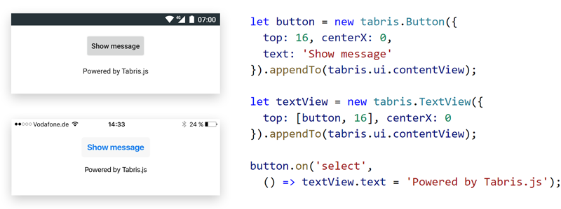

# Tabris.js

[](https://travis-ci.org/eclipsesource/tabris-js)
[](https://tabrisjs.herokuapp.com)

Tabris.js is a framework for developing mobile apps with native UIs in JavaScript.
iOS and Android apps can be built entirely from one code base, which frees you from the task of managing code for multiple platforms.



```jsx
import {Button, contentView, TextView} from 'tabris';

// in JS

new Button({top: 16, centerX: true, text: 'Use native UI'})
  .onSelect(() => $(TextView).only().text = 'Powered by Tabris.js')
  .appendTo(contentView);
new TextView({top: 'prev() 16', centerX: true})
  .appendTo(contentView);

// or in JSX

contentView.append(
  <$>
    <Button top={16} centerX text='Use native UI'
            onSelect={() => $(TextView).only().text = 'Powered by Tabris.js'}/>
    <TextView top='prev() 16' centerX/>
  </$>
);
```

## Native widgets

The code of the application is loaded dynamically - nothing is precompiled. JavaScript is executed Just-in-Time and passed via a native bridge to the device. Tabris.js accesses native controls and does not depend on webviews to render the app's UI. As a result, the performance of the apps cannot be distinguished from apps developed directly in native code of the platforms.

## Getting started

To start developing Tabris.js applications, visit [tabrisjs.com](http://tabrisjs.com) and check out the "[Getting Started](https://tabrisjs.com/documentation/latest/getting-started)" guide in the documentation. Be sure to also consult the code [snippets](https://github.com/eclipsesource/tabris-js/tree/master/snippets) in the Tabris.js Developer App (download from the app store for [Android](https://play.google.com/store/apps/details?id=com.eclipsesource.tabrisjs2) and [iOS](https://itunes.apple.com/us/app/tabris.js-2/id1166468326?mt=8)).

## Extensible

Tabris.js can be extended with [Cordova plugins](https://cordova.apache.org/plugins/) to add support for additional native features. A cordova plugin is also able to directly interface with the native widgets (as can be seen e.g. in the [tabris-plugin-maps](https://github.com/eclipsesource/tabris-plugin-maps)).
 
 Additionally [npm modules](https://www.npmjs.com/) can be used to further enrich the available JS APIs.

Tabris.js also adds support for many key web technologies including:
- _Canvas_
- _XMLHttpRequest / fetch()_
- _WebSockets_
- _localStorage_


## Online build

To package your source into a installable app, Tabris.js features an online [build service](https://tabrisjs.com/documentation/latest/build). There is no need to download a huge SDK or use specific hardware for development (e.g. a Mac machine to build for iOS). A [local build](https://tabrisjs.com/documentation/latest/local-build) is also available as an option if more customization is needed.


## Build tabris npm module

Follow these steps if you want to build the tabris module yourself.

Install the [Grunt](http://gruntjs.com) build tool using [npm](http://www.npmjs.com):

```bash
npm install -g grunt-cli
```

In the [tabris-js](https://github.com/eclipsesource/tabris-js) root directory fetch the dependencies and build:

```bash
npm install
grunt
```

## License

Published under the terms of the [BSD 3-Clause License](LICENSE).
