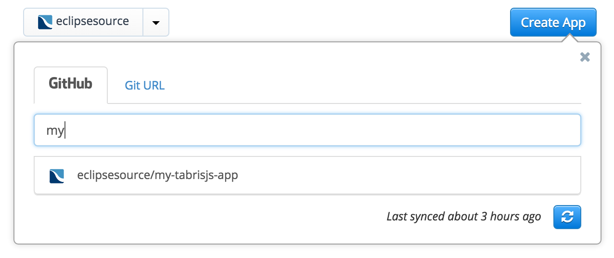
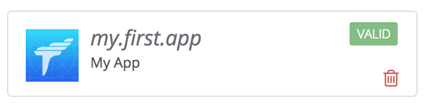
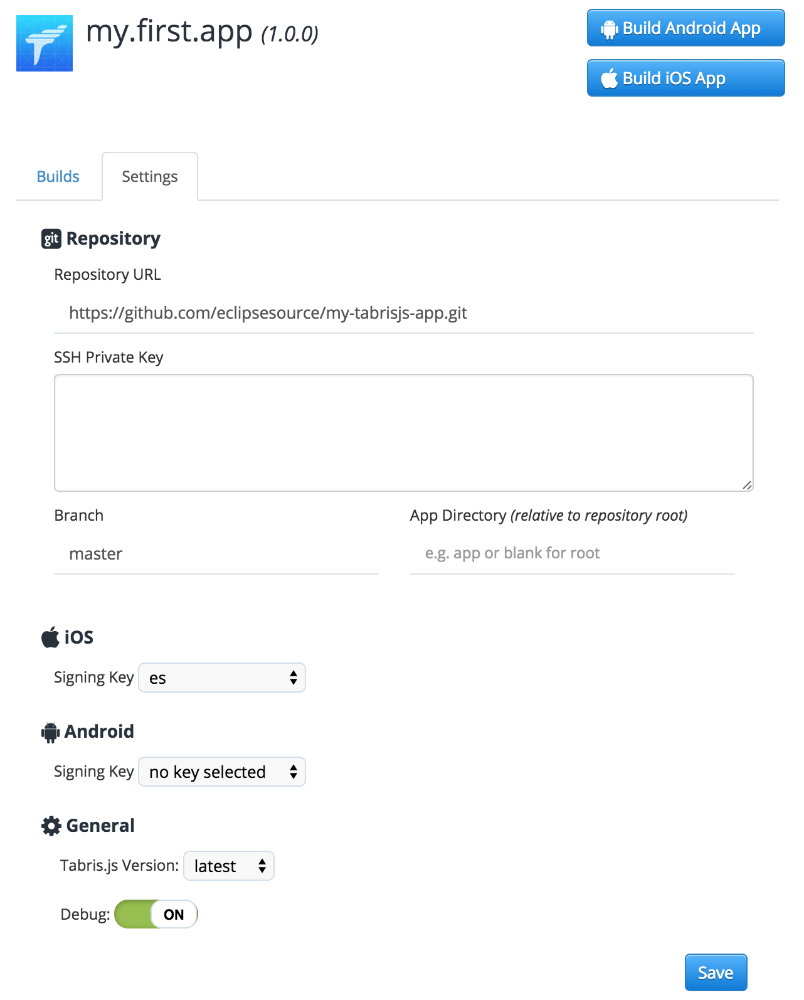

---
---
# Building a Tabris.js App

Tabris.js utilizes [Apache Cordova](http://cordova.apache.org) to build and package apps. Apps can be built without any local setup [using the free online build service](#build-service) on tabrisjs.com. To [build an app on your local machine](#local-build), you need to setup developer tools like Xcode, Visual Studio or the Android SDK. The following features are supported by the two different build types.

|                           | Build Service | Local Build |
| :------------------------ |:---------------:| :---------------: |
| Building iOS Apps         |       ✓         |       ✓      |
| Building Android Apps     |       ✓         |       ✓      |
| Building Windows Apps     |       ✓         |       ✓      |
| [Integrate Cordova Plugins](cordova.md)     |       ✓      |       ✓      |
| [Cordova Build Hooks](http://cordova.apache.org/docs/en/edge/guide_appdev_hooks_index.md.html#Hooks%20Guide)       |       ✓      |       ✓      |
| Custom Project Structure  |       ✓      |       ✓      |
| Own Build Scripts         |              |       ✓      |
| Using own build hardware  |              |       ✓      |
| Other SCMs than Git       |              |       ✓      |

> :point_right: The online build service is free for unlimited public GitHub repositories and 1 private repository. To build from unlimited private repositories, you need a [Pro account](https://tabrisjs.com/pricing/). [Local builds](#local-build) are free for everyone.

> :point_right: When building Windows apps, please also read the [Windows Support Documentation](windows-support.md) on the topic.

## Project Layout

To prepare your project for the build, you have to create a subdirectory named `cordova` that contains the build configuration. The layout of a Tabris.js project might look like this:
```
/
|- cordova/
    |- config.xml
|- src/
    |- <.js files>
|- test/
    |- <.spec.js files>
|- package.json
|- .tabrisignore
```

### The package.json file

See [package.json | npm documentation](https://docs.npmjs.com/files/package.json) for information about the package.json format.

`package.json` contains, among other configurations, references to the app's main script and npm module dependencies:

```json
{
  // ...
  "main": "src/app.js",
  "dependencies": {
    "tabris": "^2.0.0",
    "left-pad": "^1.1.3",
    // ...
  }
  // ...
}
```

Dependencies are automatically installed during the build process.

#### Build scripts

When a Tabris.js app is built, `build` scripts given in the `package.json` are executed before the JavaScript code is bundled into the app. They can be used to transpile the JavaScript app code.

```json
{
  ...
  "scripts": {
    ...
    "build": "..."
  }
  ...
}
```

Supported build script hooks are:

  - `"build"`: executed for all platform builds
  - `"build:android"`: executed for Android builds
  - `"build:ios"`: executed for iOS builds
  - `"build:windows"`: executed for Windows builds

Make sure the `"build"` script is executed before executing `tabris serve` (when running the app locally). This step can be automated by using the watch mode of your transpiler, which will compile the file on change (refer to your transpiler's documentation). A module like [npm-run-all](https://www.npmjs.com/package/npm-run-all) can help run the transpiler in watch mode and `tabris serve` at the same time.

For bigger projects you may want to use a module bundler like [rollup.js](https://rollupjs.org). It removes the overhead of loading multiple modules and uses static analysis to remove unused code from the bundled artifact.

#### Example: Transpiling ES6 code

Install the Babel transpiler and the necessary plug-ins. The `--save-dev` option will add the dependencies to your `package.json`:

```
npm install --save-dev babel-cli babel-plugin-transform-es2015-modules-commonjs
```

Create a `.babelrc` file in the root of your project:

```json
{
  "plugins": ["transform-es2015-modules-commonjs"]
}
```

Include the following build script in the `scripts` sections of your `package.json`:

```json
{
  "scripts": {
    "build": "babel --compact false --out-dir dist/ src/"
  }
  ...
}
```

Let the `main` field point to the *transpiled* `app.js` in `dist/`:

```json
{
  "main": "dist/app.js",
  ...
}
```

In case iOS 9 support is desired, more Babel plugins can be added to compensate for missing ES6 features.
See [EcmaScript 6](lang.md#ecmascript-6) for more information about supported ES6 features in iOS 9.

#### Example: Transpiling TypeScript code

Install the TypeScript compiler:

```
npm install --save-dev typescript
```

Include the following build script in the `scripts` sections of your `package.json`:

```json
{
  "scripts": {
    "build": "tsc -p ."
  }
  ...
}
```

Let the `main` field point to the *transpiled* `app.js` in `dist/`:

```json
{
  "main": "dist/app.js",
  ...
}
```

### The config.xml file

The minimal build configuration you need is a `cordova/config.xml` file that describes your app. It contains information like the id of your app, its version, icons and splash screens. The format of the `config.xml` is the same as a standard [Cordova config.xml](https://cordova.apache.org/docs/en/4.0.0/config_ref_index.md.html#The%20config.xml%20File) file. A minimal example config could look like this:

```xml
<?xml version='1.0' encoding='utf-8'?>
<widget id="my.first.app" version="1.0.0">
  <name>HelloWorld</name>
  <description>
    A sample Tabris.js application.
  </description>
  <author email="dev@tabrisjs.com" href="https://tabrisjs.com">
    Tabris.js Team
  </author>
</widget>
```

#### Integrating Cordova plugins

To add a set of Apache Cordova plug-ins you only need to add them to `config.xml` using the `<plugin />` tag. It allows you to add plug-ins using an ID, an HTTP URL or a git URL.

For example, to add the [Cordova Camera Plugin](http://plugins.cordova.io/#/package/org.apache.cordova.camera), you'd add this line:

```xml
<plugin name="cordova-plugin-camera" spec="^2.3.0" />
```

You can integrate all available [Cordova Plugins](http://plugins.cordova.io/#/) by including them in your `config.xml`.

**Important:** You can install all available Cordova Plugins. Most of the Plugins will work out of the box. However, since Tabris.js uses a **native UI** and **no HTML5**, plugins that rely on an HTML5 UI (i.e. the DOM) won't work.


#### The content element

The optional `<content>` element defines the app's starting page in ordinary Cordova apps. In Tabris.js you can use it to define an alternative location of the `package.json` file. Example:

```xml
<content src="mySubFolder/package.json" />
```

#### Preferences

In addition to the settings described in the [Cordova config.xml Guide](http://cordova.apache.org/docs/en/dev/config_ref/), Tabris.js also accepts the following custom preferences:

| Name                   | Allowed Values | Default Value | Description |
|------------------------|----------------|---------------|-------------|
| EnableDeveloperConsole | true/false     | false         | Enables/Disables the [Tabris.js Developer Console](getting-started.md#the-developer-console). Setting the value to `$IS_DEBUG` will make the value follow the value for [debug mode](#settings)|
| UseStrictSSL           | true/false     | true          | Activate/Deactivate SSL certificate validation on [XHR](w3c-api.md#xmlhttprequest). When disabled self signed SSL certificates are accepted. Should be enabled in production. |

Example:
```xml
<preference name="EnableDeveloperConsole" value="true" />
```

#### Android specific preferences

| Name                    | Value |
|-------------------------|-------|
| Theme                   |- `@style/Theme.Tabris`<br/>- `@style/Theme.Tabris.Light`<br/>- `@style/Theme.Tabris.Light.DarkAppBar` (Default)<br/><br/>In addition to the bundled Tabris themes, a resource reference to a custom Android theme can be specified. Custom themes have to inherit from one of the Tabris base themes.<br/><br/>Example: `<preference name="Theme" value="@style/Theme.MyAppTheme" />` |
| ThemeSplash             | - `@style/Theme.Tabris.SplashScreen`<br/>- `@style/Theme.Tabris.Light.SplashScreen` (Default)<br/><br/>The splash screen is shown to the user while the app is starting up. By default this screen has a white background. The `ThemeSplash` preference allows to set one of the bundled themes or to provide a custom theme.<br/><br/>Example: `<preference name="ThemeSplash" value="@style/Theme.Tabris.SplashScreen" />`<br/><br/>Note that the `config.xml` element `<splash .. />` can be used to set an image on the splash screen. For styling guides see the material design guidelines on [launch screens](https://material.google.com/patterns/launch-screens.html). |

#### Windows specific preferences

Windows apps always have a splash screen. If you do not configure one, the default Tabris.js splash screen is used. To configure your own splash screen, you have to give a logo in three different resolutions and the background color. The naming of the files has to match those given here:

```xml
<platform name="windows">
    <splash src="resources/windows/splash/SplashScreen.scale-100.png" width="620" height="300"/>
    <splash src="resources/windows/splash/SplashScreen.scale-150.png" width="930" height="450"/>
    <splash src="resources/windows/splash/SplashScreen.scale-200.png" width="1240" height="600"/>
    <preference name="SplashScreenBackgroundColor" value="#009688"/>
</platform>
```

To replace the tabris logo on the launcher tile, Windows store and task icon you also have to give all of the following files. Again, naming is relevant:

```xml
<platform name="windows">
    <icon src="res/windows/storelogo.png" target="StoreLogo" />
    <icon src="res/windows/smalllogo.png" target="Square30x30Logo" />
    <icon src="res/Windows/Square44x44Logo.png" target="Square44x44Logo" />
    <icon src="res/Windows/Small71x71Logo.png" target="Square71x71Logo" />
    <icon src="res/Windows/Square150x150Logo.png" target="Square150x150Logo" />
    <icon src="res/Windows/Large310x310Logo.png" target="Square310x310Logo" />
    <icon src="res/Windows/Wide310x150Logo.png" target="Wide310x150Logo" />
</platform>
```

### The .tabrisignore file

The tabris.js build packages the contents of your project into the app. You can exclude certain files or directories that are not required in the packaged app, such as tests or developer documentation. Files and directories to be ignored by the build can be listed in a file named `.tabrisignore`. The format of this ignore file follows the same rules as a [`.gitignore`](http://git-scm.com/docs/gitignore) file.

The following folders are excluded by default and don't have to be listed in the `.tabrisignore`:

* `.git/`
* `node_modules/`
* `build/`
* The file `.tabrisignore` itself

## Build Service

[Tabrisjs.com](https://tabrisjs.com) offers a free online build service for Tabris.js apps. After signing in you can create an app in the "My Apps" section by clicking "Create App". Now you can select your GitHub repository in the list of repositories (if it’s not visible you may need to press the "synchronize" button). Users on the [Pro plan](https://tabrisjs.com/pricing/) can also use self hosted Git repositories.

After you have selected your repository it’s going to be validated. The validation checks if the selected repository contains a valid Tabris.js [project layout](build.md#project-layout). If you have a valid project structure and `config.xml`, your app should become valid shortly. If it’s invalid, the site will tell you what went wrong. In this case please follow the instructions displayed.

After your app has become valid, you are ready to execute the first build. Just select the newly created app and click the "Start Android Build" button. A few minutes later you will get an Android .apk file which is ready to be installed on your device. But what about iOS, production builds and signing? All these things can be configured using the "Settings".

> :point_right: The build service installs the dependencies specified in your package.json from npm (except devDependencies). As a result, you don't have to put the `node_modules` folder under version control.

### Settings



* **Repository URL:** This is the URL of your git repository. If you're using the free build, it should point to a GitHub repository. Users who are on the [Pro plan](https://tabrisjs.com/pricing/) can also use custom repository locations.
* **SSH Private Key:** A SSH private key to access your repository. Only relevant for git repositories which are not hosted on GitHub.
* **Branch:** The git branch to build from. The default value is `master`. If you want to build from a feature branch, you may specify the branch here.
* **App Directory:** The directory within your repository that contains your Tabris.js app. The value must be relative to the repository root.
* **iOS Signing Key:** iOS apps can not be deployed to a mobile device without being signed. If you want to build an iOS app you need an Apple Developer account and provide the certificate together with the provisioning profile. A very good tutorial on how to get these files can be found in the [Phonegap Build documentation](http://docs.phonegap.com/phonegap-build/signing/ios/).
* **Android Signing Key:** Android apps need to be signed with a certificate only if you want to deploy them to Play Store. You can find a very good tutorial in the [Phonegap Build documentation](http://docs.phonegap.com/phonegap-build/signing/android/) as well.
* **Windows Architecure** Choose which CPU architecture you want to build your package for.
* **Environment Variables:** Key/Value pairs that will be stored and transferred encrypted to the build machines. They can be used within the config.xml or custom hooks. Use cases are adding plug-ins from private git repositories or handling access keys.
* **Builds to keep:** Specifies the number of builds that should be kept before deleting them automatically.
* **Tabris.js Version:** The Tabris.js *client* version to use in the app. In contrast to the "tabris" dependency to your `package.json` which defines the version of the JavaScript module, this setting defines the version of the native client that will interpret your JavaScript code. In most cases, the value `latest` is good enough here. But if you want to stick to a fixed Tabris.js version you can configure it here.
* **Debug:** Enables the *debug mode*. If set to `ON`, your app will be built including debug symbols and it will be packaged into the Tabris.js Developer App to make development easier. This allows you to use all the benefits like the developer console or the reload also with your own app. Please be aware that debug versions can not be submitted to the app stores. Debug `OFF` means your app will be built to be ready for release: no Developer App, no console, no reload. Only your JavaScript code is executed.

## Local Build

You can build Tabris.js apps on your local machine using the [Tabris CLI](https://www.npmjs.com/package/tabris-cli).

### Prerequisites

To build apps on your machine, the development environment for the target platform must be installed.
If you're targeting iOS, you need macOS with a recent version of Xcode.
For Windows, you need a Windows PC with Visual Studio 2017.
Android apps can be build on any OS with the latest Android SDK installed.

The Tabris CLI must be installed globally on your system:

```
npm install -g tabris-cli
```

You also need an account on [tabrisjs.com](https://tabrisjs.com). A free account is sufficient.

### Building an App

On the first start, the Tabris CLI will ask for a build key.
You can find this key on your [profile page](https://tabrisjs.com/settings/account).

To build your app, run

```
tabris build [android|ios|windows]
```

For more command-line options, please refer to the [CLI documentation](https://www.npmjs.com/package/tabris-cli).
