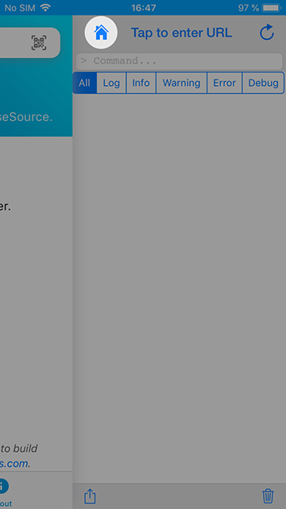
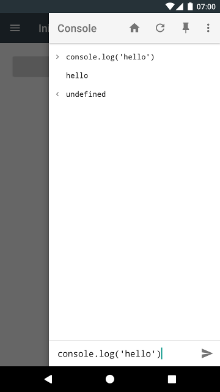
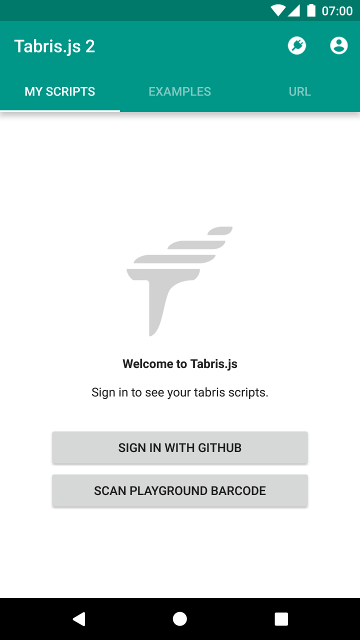
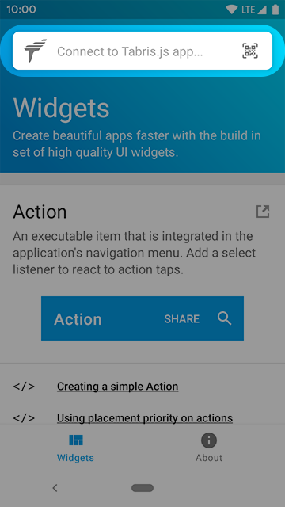

---
---
# The Tabris.js Developer App

The *Tabris.js 2* Developer App is the easiest way to see some Tabris.js examples and to start developing mobile apps without having to perform an app build.
It is available for free in the app stores – just follow the links below or search for "Tabris.js" in the store on your mobile device.

## Try the Examples

The Tabris.js examples are a collection of small apps that demonstrate the power and flexibility of the framework.
They're written entirely in JavaScript.
You can find the source code in the Tabris.js [GitHub repository](https://github.com/eclipsesource/tabris-js/tree/master/examples).

Just tap an example and it will run within the Developer App.
To get back to the examples selection, use the *Home* symbol in the [Developer Console](#the-developer-console).
On Android, you can also press the system's back button to go back.

## The Developer Console

While running Tabris.js scripts in the Developer App, you can open a developer console by sliding from the right edge of the screen to the left.
On iOS you may have to start sliding from the edge itself to open the drawer. You can also use a four-finger double tap instead.
On Windows you can also press F12, if a keyboard is present.

In the developer console you'll see messages and errors logged by the running script.
You can even enter JavaScript expressions that will be evaluated in the context of your script.

In the header, you'll find a *Reload* action that loads and starts the running script from scratch.
The *Home* action lets you go back to the Developer App.
You'll also find actions to filter the log and to share it (e.g. by email).
Finally, you can enter a different script URL directly in the header.

> :point_right: If you have trouble opening the drawer on iOS, try a four-finger double tap.

## Play with the Playground

To get started with Tabris.js development easily, try out the [Playground](https://tabrisjs.com/playground), our online code editor.
Here you'll find an editable Tabris.js “Hello World” script that you can modify and try on your mobile device immediately.
To load the playground script in your Developer App, scan the QR code on the playground page.

While you edit the code in the playground, you can always reload to see your changes in action.
Use the *Reload* button in the developer console or scan the QR code again.

> :point_right: In our [collection of snippets](https://github.com/eclipsesource/tabris-js/tree/master/snippets) you can find a code snippet for nearly every feature in Tabris.js.
If you like to play with a snippet, simply copy and paste it into the playground and run it from there.

## Sign In

When you've signed in on tabrisjs.com with your GitHub account, you can also sign in with the Developer App.
This will let you access your personal playground and other saved scripts without having to scan QR codes.

## Run your App

Just like the playground scripts, you can also load an app that you're developing on your machine.
For this to work, your mobile device must be connected to the same network as your development machine.

After [setting up your Tabris.js project](getting-started.md), you can use the [Tabris CLI](https://www.npmjs.com/package/tabris-cli) to serve your app.
In your project directory, call:

    tabris serve

The CLI will start an HTTP server and print its URL to console, for example:

    Server started.
    Point your Tabris.js client to:
      http://192.168.6.146:8080

Enter this URL in the URL tab of the Developer App and tap *Connect*.
Keep the CLI running as long as you are testing the application.

> :point_right: You may notice a considerable delay while the Developer App downloads the sources to the mobile device. Once you've [built](#publishing-your-app) the app, this delay will be gone, because the sources are then bundled with the app.
