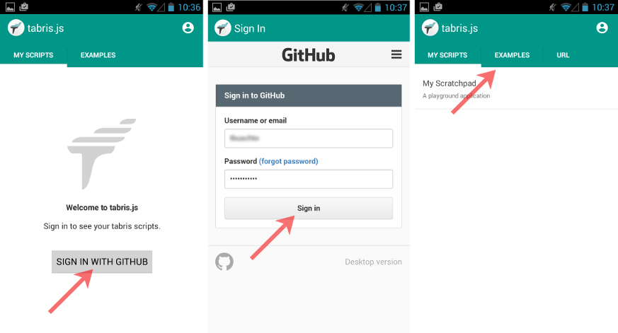
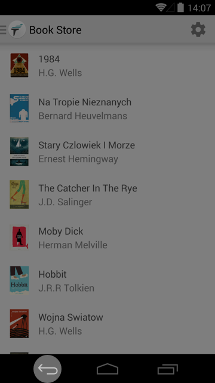
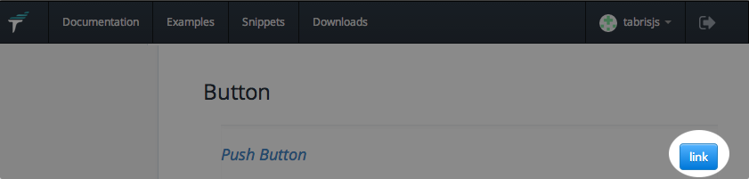
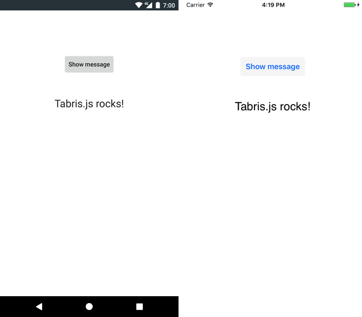
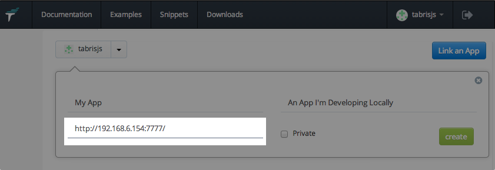

# Getting Started
Welcome to Tabris.js, the framework for developing native apps in JavaScript. Before you get started, you should be logged in to http://tabrisjs.com. This site provides you with documentation and integrates with the Tabris.js Developer App.

**If you want to start coding right away, there is also the [Quickstart](quickstart.md) guide for the inpatient expert.**

# The Tabris.js Developer App
The Tabris.js developer apps are available for free on the Apple App Store and Google Play respectively. Simply follow the links below or search for "Tabris.js" in the store on your mobile device.

[](https://play.google.com/store/apps/details?id=com.eclipsesource.tabris.js) [](https://itunes.apple.com/us/app/tabris.js/id939600018?mt=8) 

After launching the app you should sign-in with your GitHub account (the same you use on tabrisjs.com) and switch to the **Examples** tab.



## Try the Examples

The Tabris.js examples are a collection of small apps that demonstrate the power and flexibility of the framework. They are part of the Tabris.js [GitHub repository](https://github.com/eclipsesource/tabris-js/tree/master/examples) and are developed entirely in JavaScript. 


Just tap an example and it will run within the developer app. You can go back to the examples selection by using the back button in Android or [the Developer Console](#the-developer-console) on either platform.

         

## The Developer Console

While running Tabris.js scripts in the developer app, you can open a developer console by sliding from the right edge of the screen to the left. On iOS you may have to start sliding from the edge itself to open the drawer.

Here you will see messages and errors logged while running a script. You can filter the log or even share it (e.g. by email). The console also lets you go back to the developer app, or reload the script instantly.


## Play with the Scratchpad 

On tabrisjs.com, click **My Scratchpad** on the left. Here you will find a simple, editable Tabris.js script. You can run this script immediately (no need to save) in the Tabris.js Developer App by going to the *My Scripts* tab and selecting *My Scratchpad*. By default the scratchpad contains the "Hello World" example explained [below](#hello-js).

## The Tabris.js Snippets 

On the [tabrisjs.com snippets page](https://tabrisjs.com/snippets/) you can find a code snippet for nearly every feature in Tabris.js. You can run a snippet immediately on your device by clicking the **link** button next to it...



... and then select it from the **My Scripts** list of the developer app. You may have to refresh the list by swiping down on Android or by switching tabs on iOS.

If you like to play with the snippet, simply copy and paste it to the scratchpad and run it from there.

# Create Your First App
Tabris.js scripts can be developed using any text editor or IDE.

Clone or [Download](https://github.com/eclipsesource/tabris-js-getting-started/archive/master.zip) the [Getting Started Project](https://github.com/eclipsesource/tabris-js-getting-started) to begin developing your first Tabris.js app.

    git clone https://github.com/eclipsesource/tabris-js-getting-started.git

It contains a minimal Tabris.js project, which consists of two files:

### package.json
The `package.json` file is used to describe the app, including the name, description, dependencies and the main script. Every Tabris.js app should include a package.json.

```javascript
{
  "name": "hello-world",
  "description": "Tabris.js - Hello, World!",
  "main": "hello.js",
  "dependencies": {
    "tabris": "^1.0.0"
  }
}
```

### hello.js
The Tabris.js "Hello, World!" example is contained in `hello.js`. It contains a *button* and a *text view*. When the button is selected, the text view is updated. For further documentation on widgets, visit the [Widgets](widgets.md) article and [Widgets API reference](widget-types). 

```js
var page = tabris.create("Page", {
  title: "Hello, World!",
  topLevel: true
});

var button = tabris.create("Button", {
  text: "Native Widgets",
  layoutData: {centerX: 0, top: 100}
}).appendTo(page);

var label = tabris.create("TextView", {
  font: "24px",
  layoutData: {centerX: 0, top: [button, 50]}
}).appendTo(page);

button.on("select", function() {
  label.set("text", "Totally Rock!");
});

page.open();
```

### Test your app

First, make sure the following prerequisites are met:

 - Your target Android/iOS device (real or emulated) is connected to the same network as your development machine. You have the developer app installed and are logged in with your GitHub account. 
 - You have [node.js](http://nodejs.org/) installed on your development machine and you can execute the `npm` command from the command line. 
 
In your Tabris.js project directory, type the following:

    npm install http-server -g
    npm install
    http-server

The first line installs the http-server we use. You only need to do this once.
The second line installs Tabris.js (the version given in the `package.json`) in your project. You need to do this once per project. 
The third line starts the http-server. The server needs to run as long as you test the application.

In the URL tab of the developer app, enter:

    http://<development-machine-ip-address>:8080/

Now tap *Connect* to run the app:



Each time the your app is started, the sources are downloaded to the device. While this happens you will see a blank screen. Once you've [built](#publishing-your-app) the app, this delay will be gone, because the sources are then bundled with the app. 

If the URL of your developer machine is stable, you can also use the *My Scripts* page on [tabrisjs.com](http://tabrisjs.com) to add it permanently to the **My Scripts** tab. 



## Publishing your app

For submission to the App / Play Stores you will need to bundle, brand and build your app, either using the free online build service or using local tools. This process is explained in [Build your app](build.md).

## Feedback
Help us improve Tabris.js! [Feedback](mailto:care@eclipsesource.com?subject=Tabris.js%20feedback) is always welcome. Feel free to invite your friends if you find Tabris.js interesting.
