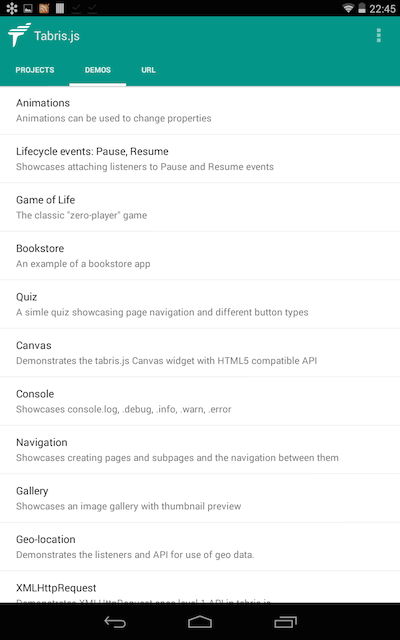
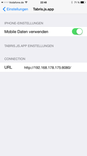
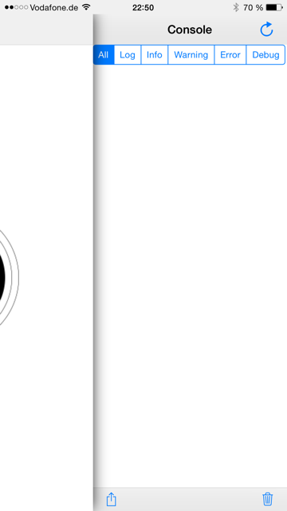
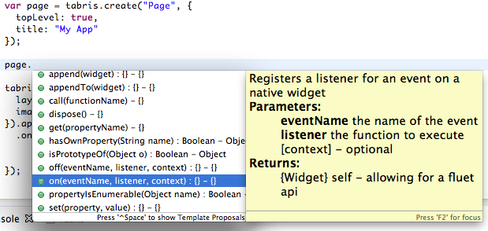
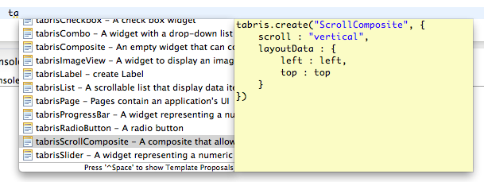

Getting Started
===============
Get the developer clients

* Android: Download the apk (from [here](http://download.eclipsesource.com/technology/tabris/android/tabris-android-launcher-js-debug.apk))
* iOS: Use your testflightapp invitation to install

The Android developer client enables you to connect with tabris-connect, browser examples and load a javascript app from any url. The url is configured on the URL tab.

The iOS client currently allows to open a javascript app from any url. The url is configured in the “Settings” app under Tabris.js.app

Launching your own app
======================
Your own app needs to provide an index.json file that references all javascript files your application needs (at least the tabris.js and your own code). Point the url to the directory which contains the index.json file and launch the app. Thats it.

Getting insight into your app
=============================
Both developer clients provide a console view that can be slid into the application main view from the right of the app. The console log also features a reload button to speed up the develop / deploy cycle.

 

Debugging your app
==================
Debugging is only supported for Android. You need an Eclipse Installation with the ChromeDevTools integrated. Create a new debug configuration for “Standalone V8 VM” and enter the ip-address of your device. Enter 20001 for the port and press connect. Obviously the developer app must be running. You can find the source code of your app now in a project that is automatically added to your workspace with the name of your debug configuration. Breakpoints and inspection of variables work as expected.

You can get a ready to work IDE by downloading Eclipse from this link:
https://yoxos.eclipsesource.com/team/team1/profile/a5d10661b982a709e760b63763f94103 

Eclipse JavaScript tooling
==========================
Feel free to use any editor you like to develop your app. If you would like to use Eclipse and get some code completion, error checking and inline documentation you can use the IDE already mentioned above.

To enable the code completion you have to use the project template provided here:
https://github.com/jkrause/tabris.js-template/

If you import the ‘templates.xml’ which is contained in the project you will have templates for creating all widget types. Just type tabris[ctrl]-space and have fun. Templates can be imported in Preferences-JavaScript-Editor-Templates.
 

Documentation
=============
You can find reference documentation for all widgets as well as some background articles about layouting, events and more on staging.tabrisjs.com

[http://staging.tabrisjs.com/documentation/](http://staging.tabrisjs.com/documentation/)

