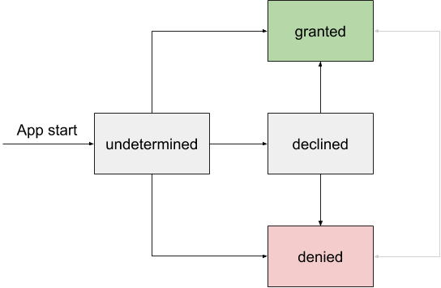

---
---
# Runtime permissions

Permissions serve to protect the privacy of a user. In order the access features like the devices location or camera, the user has to grant permissions to access them. Tabris.js offers a set of [permission APIs](api/permission.md) to check and request app permissions at runtime.

The Tabris.js permission model offers an abstraction on top of the [Android](https://developer.android.com/guide/topics/permissions/overview) and [iOS](https://developer.apple.com/design/human-interface-guidelines/ios/app-architecture/requesting-permission/) permissions system, allowing to have a consistent cross-platform API. In order to be a good citizen on each platform, some platform specific features have been added as described below.

## Quickstart

To quickly get started with permission handling, the following snippet outlines the available Tabris.js permission APIs. It shows how to use the [`tabris.permission`](api/permission.md) object to check and request permissions.

```js
import {permission} from 'tabris';

if (permission.isAuthorized('camera')) {
  console.log('Camera permission is available');
} else {
  (async () => {
    const status = await permission.requestAuthorization('camera');
    console.log(`Camera permission has been ${status}.`);
  })();
}
```

To get a deeper understanding of how to enable and consume the permissions please consult the following sections.

## Enabling a permission

:information_source: Android and iOS both have hard requirements to provide compile time details to enable a permissions during app runtime. These settings can be configured in the platform specific sections of the apps `config.xml` file. On Android the permission name has to be provided in the `AndroidManifest.xml` whereas on iOS an explanatory string has to be added to the `*-Info.plist` file. See the [documentation](./build.md) on how to create a custom app build for general details.

When defining an Android permission make sure to make the `'android'` xml-namespace available in the `<widget>` root element of the `config.xml` file:

```xml
<widget xmlns:android="http://schemas.android.com/apk/res/android" ... >
```

## Supported permissions

To request a permission you can either use a cross-platform supported _permission category_ or a _concrete permission_ on Android. The list of supported categories can be found below.

Since the native Android platform does not support to request a broad set of permissions by category, Tabris.js maps the category to a set of concrete permissions. The applied mapping matches the Android [permission group documentation](https://developer.android.com/guide/topics/permissions/overview#perm-groups). Note that requesting a [dangerous permission](https://developer.android.com/guide/topics/permissions/overview#dangerous_permissions) in an Android permission group implicitly grants you access to other permissions in the same group.

The concrete Android permissions are string based, which allows to request any permission by its name, even when they are not listed below.

### Category `'camera'`

The `'camera'` permission category allows you to access any of the devices optical cameras. Note that recording audio requires a separate microphone permission.

#### Android

On Android the `'camera'` permission category is mapped to the following Android permission:

* [`android.permission.CAMERA`](https://developer.android.com/reference/android/Manifest.permission.html#CAMERA)

To enable the permission in the `config.xml` file add  the following entry inside the `<platform name="android">` element.

```xml
<config-file target="app/src/main/AndroidManifest.xml" parent="/manifest">
  <uses-permission android:name="android.permission.CAMERA"/>
</config-file>
```

#### iOS

To provide the explanatory text in the `config.xml` file add the following entry inside the `<platform name="ios">` element:

```xml
<edit-config file="*-Info.plist" target="NSCameraUsageDescription" mode="overwrite">
  <string>Use the camera to take a picture.</string>
</edit-config>
```

### Category `'location'`

The `'location'` permission category allows you to access the devices location. The accuracy of the location depends on the physical sensors used (GPS, wifi-triangulation, etc.)

#### Android

On Android the `'location'` permission category is mapped to the following concrete Android permission:

* [`android.permission.ACCESS_COARSE_LOCATION`](https://developer.android.com/reference/android/Manifest.permission.html#ACCESS_COARSE_LOCATION)
* [`android.permission.ACCESS_FINE_LOCATION`](https://developer.android.com/reference/android/Manifest.permission.html#ACCESS_FINE_LOCATION)

To enable the permission in the `config.xml` file add the following entry inside the `<platform name="android">` element.

```xml
<config-file target="app/src/main/AndroidManifest.xml" parent="/manifest">
  <uses-permission android:name="android.permission.ACCESS_COARSE_LOCATION"/>
  <uses-permission android:name="android.permission.ACCESS_FINE_LOCATION"/>
</config-file>
```

#### iOS

To provide the explanatory text in the `config.xml` file add the following entry inside the `<platform name="ios">` element:

```xml
<edit-config file="*-Info.plist" target="NSLocationWhenInUseUsageDescription" mode="overwrite">
  <string>Allow location access to get current location.</string>
</edit-config>
```

## Permission status

During the lifecycle of an app the permission status can move to different states. The following graph shows the most common states and the possible transitions between them.



When requesting multiple authorization states at once the result will be returned in the order of least authorization. Thereby it is easy to reason about further steps (eg request authorization).

1. `rejected`
2. `undetermined`
3. `declined`
4. `denied`
5. `granted`

As an example we can look at the two permission categories `'camera'` and `'location'`. When `'camera'` is `'granted'` but `'location'` is `'undetermined'` a call to `permission.getAuthorizationStatus('camera', 'location')` would return `'undetermined'` since this status is higher in the hierarchy. In a typical app we could now request authorization for both categories which would only prompt the user for the `'location'` permission.

### Status `'undetermined'`

When a permission has not been requested, its status is `'undetermined'`. The permission has not been requested and it is possible to prompt the user to grant the permission via `permission.requestAuthorization('permission')`.

### Status `'granted'`

The permission has been granted by the user. It is now possible to invoke Tabris.js API which requires the permission.

While it is not possible to change the `'granted'` state programmatically, the user is still able to deny the permission in the app settings. Toggling a permission in the settings will restart the app and subsequent interactions with the permission API will return the new status.

### Status `'declined'` (Android only)

The Android only status `'declined'` indicates that the user has not given the permission to access a resource. However the user has not checked the "Don't ask again" checkbox or hit the corresponding dialog button. Therefore it is possible to ask for the same permission again.

It is good practice to display additional information before re-requesting the permission, explaining why the app needs the particular permission.

### Status `'denied'`

When a permission is in the state `'denied'`, the user has declined the permission. In this state it is not possible to request a permission and subsequent API calls to do so will not show a permission dialog.

However, the user is still able to grant the permission in the app settings. Toggling a permission in the settings will restart the app and subsequent requests to the permission API will return the new status.

### Status `'rejected'` (iOS only)

A permission status can be `'rejected'` on iOS when the device policy has disallowed to request the permission or the permission has been locked in the settings app. When a permission is locked while not being granted its status will switch to `'rejected'`. When the permission is locked while the status is `'granted'`, the permission will stay `'granted'`.

When a permission is `'rejected'` it is not possible to request the permission programmatically.

## Checking permissions

A permission status can change during the apps lifecycle or when it is changed in the app settings. Therefore whenever an API is used which requires a permission, the API call needs to be guarded by a permission check.

Tabris.js exposes all of its permission handling APIs via the `tabris.permission` object. It allows to request permissions and to check permission authorization status. To check an authorization status you can get the current status via `permission.getAuthorizationStatus('permission')`. In addition the `permission` object offers several utility methods to simplify common use-cases.

```js
// returns the current state eg. 'granted' or 'denied'
permission.getAuthorizationStatus('permission');

 // returns true if state is 'undetermined' or 'declined'
permission.isAuthorizationPossible('permission');

// returns true if state is 'granted' or 'declined'
permission.isAuthorized('permission')
```

## Requesting permissions

In order to request a permission the method `permission.requestAuthorization()` can be used. If the current permission status allows to request a permission, the call prompts the user to grant the permission and returns the result in the resolved promise. If the status can not be changed, the current status is returned by the resolved promise.

```js
// returns a promise which resolves with the new authorization status
await permission.requestAuthorization('permission');
```

## Typical permission workflow

A typical permission workflow in Tabris.js will mimic the following snippet.

```js
if (permission.isAuthorized(...permissions)) {
  console.log('permissions is granted');
} else if (permission.isAuthorizationPossible(...permissions)) {
  requestPermissions(...permissions).catch((error) => console.log(error));
} else {
  console.log('None of the permissions are eligible to request authorization.');
}

async function requestPermissions(...permissions) {
  switch (await permission.requestAuthorization(...permissions)) {
    case 'granted':
      console.log('The permission has been granted');
      break;
    case 'declined':
      console.log('User needs more explanation why he should grant permission.');
      break;
    default:
      console.log('The permissions has been denied.');
      break;
  }
}
```

## Further information

The following snippets demonstrate how to use the `tabris.permission` API.

* [permission.jsx](${doc:permission.jsx})
* [permission-advanced.tsx](${doc:permission-advanced.tsx})

Also see the [Android](https://developer.android.com/guide/topics/permissions/overview) and [iOS](https://developer.apple.com/design/human-interface-guidelines/ios/app-architecture/requesting-permission/) documentation on permission.
