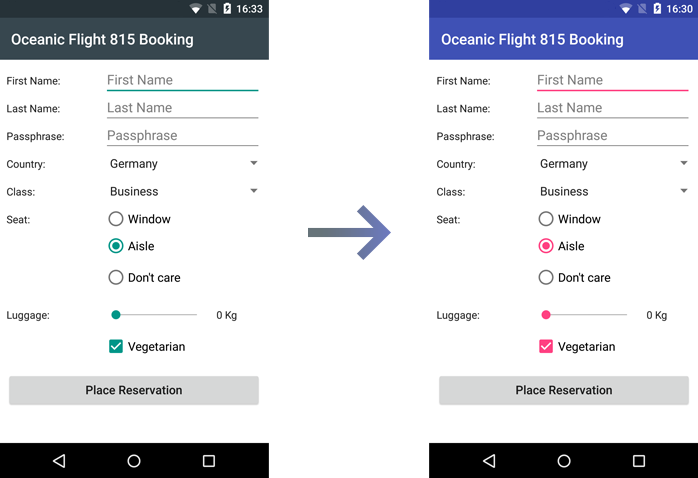

---
---
# Theming an Android app

Changing the global appearance of an app is a common scenario to provide a brand specific look. We can change the appearance of a `Widget` via the Tabris.js API or use a native platform specific mechanism to change the apps style. The later mechanism is only available on Android, since iOS does not have the concept of an app theme.



## Android native theme

When the Tabris.js API is not sufficient to style all aspects of a `Widget` it is possible to provide a native [theme on Android](https://developer.android.com/develop/ui/views/theming/themes). The main use-case is to set the primary and secondary colors which are used throughout the app's widgets. These colors are also applied on the `StatusBar` and in the Android task switcher.

### Declaring a theme

The following theme file _resources/android/values/myapp_theme.xml_ depicts how to define your custom color palette. The paths folder structure has to start next to the app's `config.xml` in the `cordova/` folder.

```xml
<?xml version="1.0" encoding="utf-8"?>
<resources xmlns:android="http://schemas.android.com/apk/res/android">

  <style name="Theme.MyApp" parent="@style/Theme.Tabris.Light.DarkAppBar">
    <item name="colorPrimary">#039be5</item>
    <item name="colorPrimaryVariant">#0288d1</item>
    <item name="colorSecondary">#ffab00</item>
    <item name="android:statusBarColor">#0288d1</item>
  </style>

</resources>
```

The xml file configures the `colorPrimary`, `colorPrimaryVariant` and `colorSecondary`. It also inherits from the base theme `@style/Theme.Tabris.Light.DarkAppBar` which is provided by the Tabris.js Android platform. To apply the styling correctly a custom theme has to inherit from one of the three Tabris.js base themes:

* `@style/Theme.Tabris` (dark theme)
* `@style/Theme.Tabris.Light` (light theme)
* `@style/Theme.Tabris.Light.DarkAppBar` (light theme with dark `NavigationView` toolbar; default)

### Applying a theme

With the theme file created, we have to apply it in our Tabris.js app. First we declare where to find our theme file and then register it with our Android app.

The following excerpt shows how to copy the created _myapp_theme.xml_ via the `<resource-file>` element into the app and to apply it via the `<preference>` element.

```xml
<platform name="android">

    <resource-file src="resources/android/values/myapp_theme.xml"
                   target="app/src/main/res/values/myapp_theme.xml" />

    <preference name="AndroidPostSplashScreenTheme" value="@style/Theme.MyApp" />

</platform>
```

The `target` attribute of the `<resource-file>` has to point to the exact path as shown above, while the file name _myapp_theme.xml_ can vary. The `<preference>` element uses the `AndroidPostSplashScreenTheme` key from the standard [cordova splashscreen API](https://cordova.apache.org/docs/en/11.x/core/features/splashscreen/). Its `value` attribute has to reference the theme style in the Android typical notation of `@style/Theme.MyApp` as declared above.

### Further resources

* See the [build documentation](./build.md#preferences) for more information on the available preferences.
