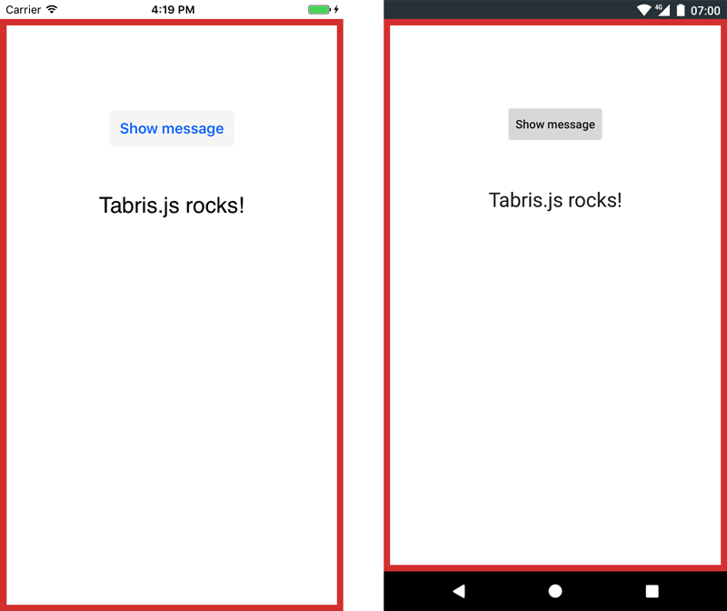
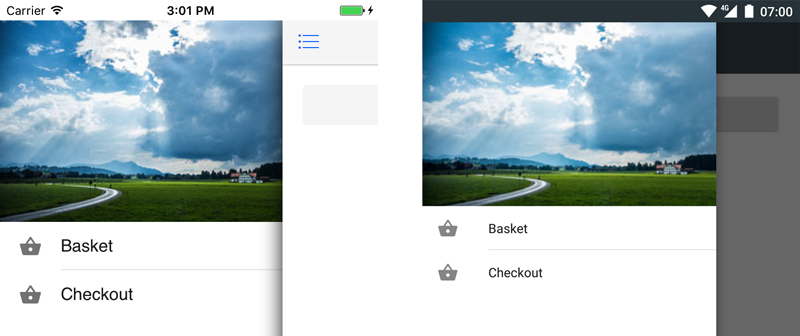
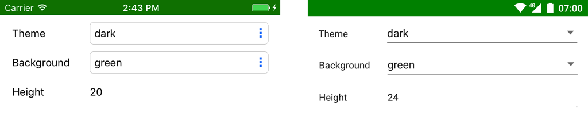
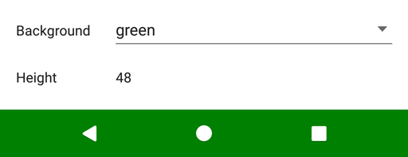

---
---
# UI Architecture

The UI of a Tabris.js app consists of platform-native elements that can be controlled by a cross-platform JavaScript API. Within the framework these elements are implemented in native code and provide a user experience that feels familiar on each OS.

## Type Hierarchy

In Tabris.js all objects that represent visual elements inherit from the [`NativeObject`](./api/NativeObject.md) class which provides very basic event and property handling functionality.

Important subclasses include:

```
tabris.NativeObject
 |- tabris.Tabris
 |- tabris.Widget
 |  |- tabris.Button
 |  |- tabris.Composite
 |  |  |- tabris.ContentView
 |  |     |- tabris.Drawer
 |  | - ... etc ...
 |- tabris.Popup
 |  |- tabris.AlertDialog
 |  |- tabris.Popover
 |  |- ... etc ...
 |- tabris.StatusBar
 |- tabris.NavigationBar
 | ... etc ...
```

As can be seen here, most UI elements either inherit from `Widget` or `Popup`.

**Widgets** can (with some exceptions) be freely [created](./widget-basics.md#Hello-World), [arranged](./layout.md) and [composed](./widget-basics.md#Composition) to form the main UI of your application.

**Popups** are floating on top of your main UI and are specialized for specific use cases. Unlike widgets they never need a parent to be visible and they can not be combined in any way.

All other types are special cases that will be explained below.

## Object Hierarchy

The top-level parent for the main UI is represented by the global object `tabris`, which also acts as the namespace that holds all public classes and singletons of the framework.

```
tabris
|- tabris.contentView
|- tabris.drawer
|- tabris.statusBar
|- tabris.navigationBar
```

## ContentView

`tabris.ContentView` is a subclass of `tabris.Composite` and the only widget that is visible without any kind of parent. It can not be instantiated by application code. Instead, any instance is bound to another `tabris.NativeObject`, like the global `tabris` object, e.g. `tabris.contentView` representing the main app content. Newly created widgets can be added directly to that instance to make them visible immediately:

JSX:
```jsx
tabris.contentView.append(
  <SomeWidget />
);
```

JS:
```js
tabris.contentView.append(
  new SomeWidget()
);
```



[`Popover`](./api/Popover.md) dialogs also have `ContentView` instances attached.

## Drawer

`tabris.drawer` is a singleton instance of `tabris.Drawer`, extending `tabris.ContentView`. It's a widget container that can be slid in from the left edge of the screen, typically used for top-level navigation.

In Tabris.js, this drawer is disabled by default. To use it in an application, you have to enable it:

```js
tabris.drawer.enabled = true;
```



The drawer can be opened by a swipe from the left edge of the screen or by tapping the action on the left side of a `NavigationView` ( "hamburger button" or "[drawer action](./api/NavigationView.md#drawerActionVisible)"). To open and close the drawer programmatically, you can use its `open()` and `close()` methods, respectively.

Just like `tabris.contentView` a drawer may contain any kind of widgets:

```jsx
tabris.drawer.append(
  <SomeWidget />
);
```

Widgets can be added to the content view, and optionally to the drawer.

## StatusBar

`tabris.statusBar` is a singleton instance of `tabris.StatusBar`, extending `tabris.NativeObject`. It represents the small area - usually on the top of the screen - that displays notifications, status icons and time. The object can be used to control different aspects of the element's look and feel, such as background color and visibility.



## NavigationBar

`tabris.navigationBar` is a singleton instance of `tabris.NavigationBar`, extending `tabris.NativeObject`. It represents the area that contains the *Back*, *Home*, etc. buttons on Android. The object can be used to control that element's background color and visibility.



