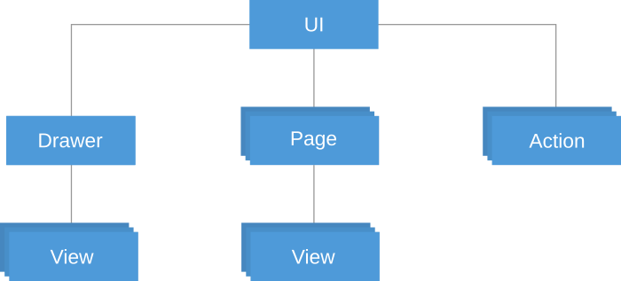
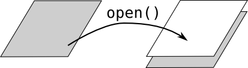
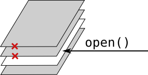
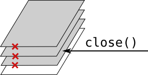

# The Widget Tree

The UI of a Tabris.js app consists of native [Widgets](widget-basics.md). Every widget must have a parent to become visible on the screen. The top-level parent for all widgets is called *UI* and it is represented by the object `tabris.ui`.



## The Page Stack

Most widgets are contained in a [*Page*](api/Page.md). An app can contain one or more pages. Only a single page is visible at a time, this is called the *active page*. A page can be activated by calling its `open()` method. Opening a page will put it on a *page stack*, covering the current active page.



When a page is opened that is already on the page stack, all pages on top of it will be closed and removed from the stack.



A page can also be removed from the stack by calling its `close()` method. When a page is closed, all pages on top of it are also closed and removed from the stack. Closing a page also disposes of it, that is, a closed page cannot be re-used.



There must always be one active page remaining in an application. Because of that, closing the last page on the stack will lead to an error.

All pages are automatically children of `tabris.ui`, so they don't have to be added to a parent.

```js
new tabris.Page({
  title: "My Page",
  image: "images/my-page.png"
});
```

## Top-level Pages

There's a special kind of pages used for the main navigation, called *top-level* pages. For those pages, different rules apply:

* When a top-level page is opened, it will replace all pages on the stack. Hence top-level pages cannot be stacked on top of other pages, they always remain at the root of the stack.

* When a top-level page is removed from the stack by opening another top-level page, it will not be closed, so it can be re-used.

To create a top-level page, set the property `topLevel` to `true` when creating the page:

```js
new tabris.Page({
  title: "My Page",
  image: "images/my-page.png",
  topLevel: true
});
```

The [bookstore demo](https://github.com/eclipsesource/tabris-js/tree/master/examples/bookstore) is a good example for the use of top-level pages and stacked pages.

## Accessing Pages

Since all pages are children of `tabris.ui`, you can always access all pages using a type selector:

```js
var pages = tabris.ui.children("Page");
```

You can also attach an id attribute to a page and access it by:

```js
var mypage = tabris.ui.children("#my-id");
```

## The Navigation Bar

The current active page is visible in the app's navigation bar. A page can have a title and an image that will be displayed in this bar (the image is not visible on all platforms). When there is more than one page on the stack, the navigation bar will display a back button to allow the user to navigate back to the previous page. This will close the current page and remove it from the stack. On Android, the system back button can also be used to navigate back.

## The Navigation Drawer

The "Drawer" is a common component of mobile applications. It's a container that can be slid in from the left edge of the screen, often used for top-level navigation. In Tabris.js, such a drawer can be created by instantiating the type `Drawer`:

```js
new tabris.Drawer();
```

Similar to pages, the drawer does not need to be appended to a parent, it is always a child of `tabris.ui` and can be accessed using `tabris.ui.children("Drawer")`.

A drawer can be opened by a swipe from the left edge of the screen or by tapping the menu item on the left side of the navigation bar. To open and close the drawer programmatically, you can use its `open()` and `close()` methods, respectively.

A drawer may contain any kind of widgets. To display a list of top-level pages, Tabris.js provides the type `PageSelector` for convenience. The page selector is a collection view that displays all top-level pages and allows to open one of them. It is pre-configured to be easily appendable to the drawer without setting any properties:

```js
new tabris.Drawer().append(new tabris.PageSelector());
```

Since PageSelector extends CollectionView, it supports the same properties. For example, you can freely position the PageSelector on the drawer by overwriting the `layoutData` property.

```js
new tabris.ImageView({
  image: "images/my-logo.png",
  scaleMode: "fill",
  layoutData: {left: 0, right: 0, top: 0, height: 200}
}).appendTo(drawer);

new tabris.PageSelector({
  layoutData: {left: 0, top: 200, right: 0, bottom: 0}
}).appendTo(drawer);
```
