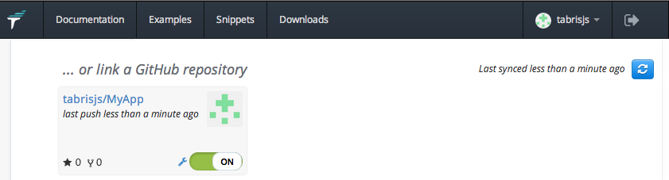
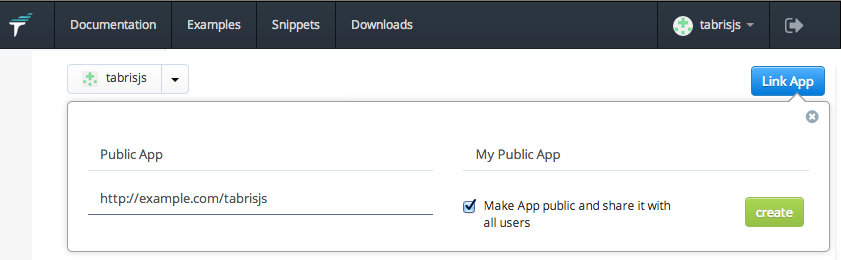

# Create Your First App
[Clone or Download the Getting Started Project](https://github.com/eclipsesource/tabris-js-getting-started) to begin developing your first tabris.js app.

    https://github.com/eclipsesource/tabris-js-getting-started/archive/master.zip
    or
    git clone https://github.com/eclipsesource/tabris-js-getting-started.git

## Hello, World!
The Getting Started Project contains a simple *Hello, World!*. You can run this directly from the Examples tab in the tabris.js developer app, or extend it and host it locally. This example provides a minimal tabris.js script, the core ingredients of your app.

### package.json
The `package.json` file is used to describe the app, including the name, description, dependencies and a the main source files. Every tabris.js app should include a package.json.
```js
{
  "name": "hello-world",
  "description": "Tabris.js - Hello, World!",
  "main": "hello.js"
}
```

### hello.js
The tabris.js Hello, World! example is contained in `hello.js`. Tabris.js apps can be developed using any text editor or IDE.

```js
var page = tabris.create("Page", {
  title: "Hello, World!",
  topLevel: true
});

var button = tabris.create("Button", {
  text: "Native Widgets",
  layoutData: {centerX: 0, top: 100}
}).appendTo(page);

var label = tabris.create("Label", {
  font: "24px",
  layoutData: {centerX: 0, top: [button, 50]}
}).appendTo(page);

button.on("selection", function() {
  label.set("text", "Totally Rock!");
});

page.open();
```

The Hello, World! example contains a *button* and a *label*. When the button is selected, the label is updated. Both the button and the label are placed on the *page* relative to one another.


### Test drive your app
The simplest way to test drive your app is to use the Tabris.js app on your device. The scripts that make up your app can be run on the device using a JavaScript runtime and our native widget bindings. On iOS the WebKit JavaScriptCore is used for JavaScript execution, on Android a V8 runtime is bundled with Tabris.js.

To make your scripts available to the tabris.js app you need to run a webserver on your local development machine. If you don't have one running on your system you can use a tiny Node.js HTTP server. Download and install [node.js](http://nodejs.org/), and using the node package manager, install `http-server`. From your hello world directory, run:

    [$] npm install http-server
    [$] http-server

*You can also place your `package.json` and `hello.js` files on any other http-server, as long as it's accessible from your device.*

Once your JavaScript files can be accessed by a http url, use the tabris.js developer app to test them. You can enter the url on the URL tab on the developer app. In the case of a node-js http-server running on your development machine, enter:

    http://<development-machine-ip-address>:8080/

The *My Scripts* page on [tabrisjs.com](http://tabrisjs.com) can also be used to configure the URLs available on your device, simply press the *Link Script* button. Then enter the URL of the web server that is hosting your tabris.js Script and save.


### The Developer Console
The tabris.js developer app ships with a developer console that can be used to track log messages, warnings and errors in the running tabris scripts. The console can be slid from the right side of the screen after you have clicked on an example or linked script. The console provides functionality to filter messages, reload the script and much more.


Messages can be logged to the console using the global console object:

```js
console.log("A log message");
console.error("An error Message");
console.warn("A warning message");
console.info("An info message");
console.debug("A debug Message");
```

## Share
GitHub repositories that contain a tabris.js scripts (a `package.json` and the JavaScript files) can be easily accessed on your device. Just go to the *My Scripts* page on tabris.js.com and turn sharing ON. The app will then appear on your device on the *My Scripts* tab.



Tabris scripts accessible at a public URL can also be shared. On tabrisjs.com choose *My Apps* and *Link Script*. Enter the URL and select the checkbox *Make Script public*. Publicly available tabris.js apps will appear on the *Grand Central* page on tabrisjs.com.



## Publishing your app

For submission to the App / Play Stores you will need to bundle, build and brand your app. The publishing workflow is not yet supported on tabrisjs.com, we will offer both a local build (which will rely on having local SDKs) and a build service.


## Further Information
http://tabrisjs.com is your key to tabris.js. The website is filled with documentation, examples, the tabris.js development roadmap, and tools for connecting with your device. The website also contains links to the examples and snippets.
